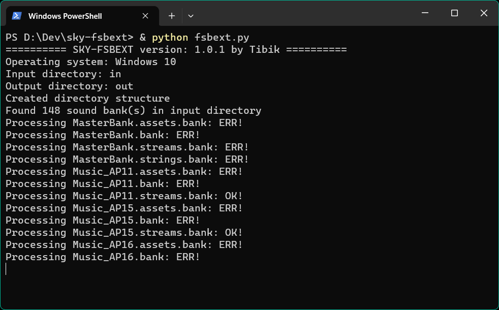
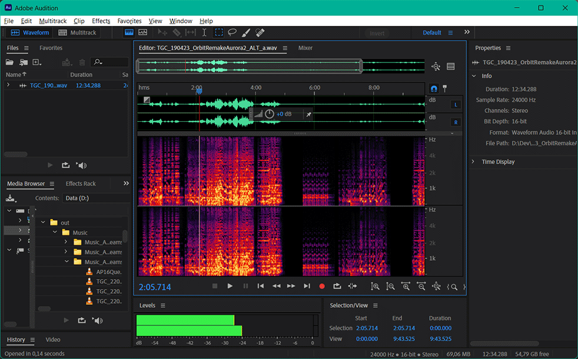

# Sky: CotL Fmod Extractor

This script extracts audio data from sound banks in the assets folder of the video game Sky: Children of the Light and saves them as .wav files using the vgmstream audio decoder.

The extracted audio files can be used to listen to the game's audio outside of the game environment, for example, with a regular audio player or for other non-commercial purposes.

## Prerequisites
- Go 1.22.7 or higher
- vgmstream-cli
- An unpacked Sky APK with the sound banks you wish to extract (usually located at `/path/to/apk/assets/Data/Audio/Fmod/fmodandroid/`).
- 7 GB minimum free disk space

## Usage
1. Ensure that `vgmstream-cli` is installed and accessible from the command line.
2. Build the program using `go build`.
3. Run the program with optional command-line arguments:
    - `-i` or `--input-dir` to specify the path to the input directory (default is `in`).
    - `-o` or `--output-dir` to specify the path to the output directory (default is `out`).
    - `-p` or `--vgmstream-path` to provide the path to the `vgmstream-cli` executable (default is `vgmstream-win64/vgmstream-cli.exe`).
    - `-c` or `--compression-ratio` to specify the compression ratio used for calculating disk space requirements (default is 8.0).
    - `-v` or `--verbose` to enable verbose output.
    - `-w` or `--workers` to set the number of concurrent workers (default is 4).
    - `--version` to print the program version.
4. Wait for the program to finish processing.
5. The extracted audio files will be located in the output directory.

## Configuration
- The program logs its progress to `fsbext.log`.
- The directory structure for the extracted audio files is as follows:
    - Music
    - SFX
    - Other

## Screenshots

<table>
  <tr>
    <td valign="top" style="text-align: center;">
       
      Demo
    </td>
    <td valign="top" style="text-align: center;">
       
      Extracted Audio Waveform and Spectrum
    </td>
  </tr>
</table>

## Contributing
Pull requests are welcome. For major changes, please open an issue first to discuss what you would like to change.
